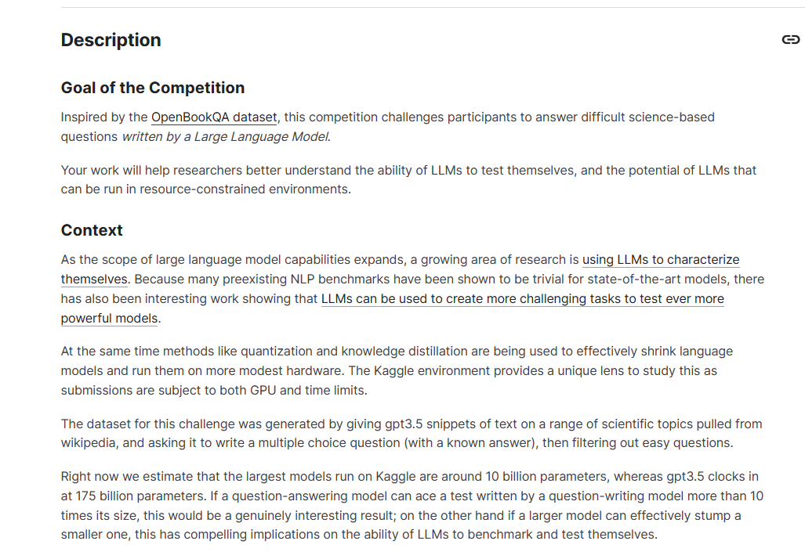
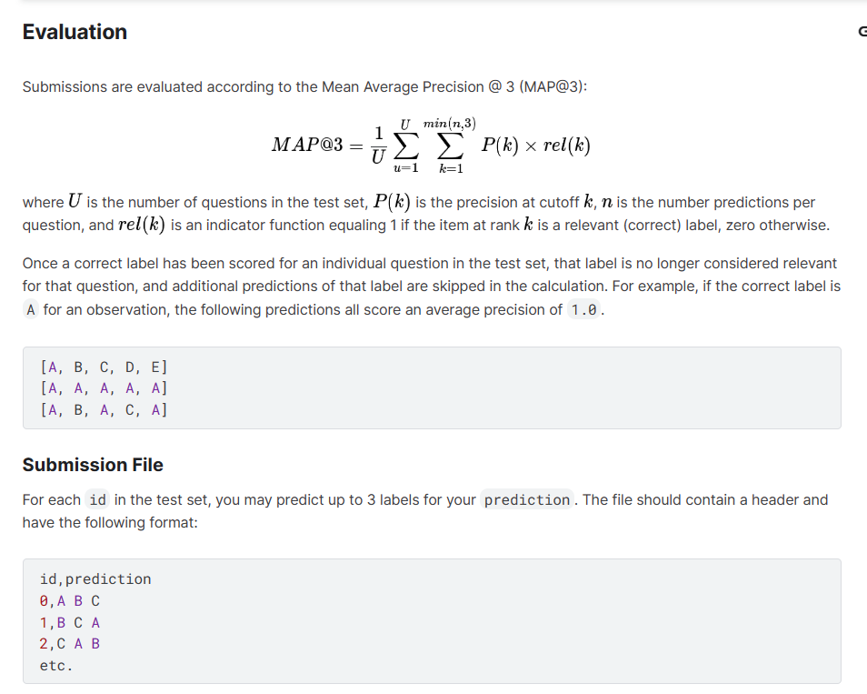
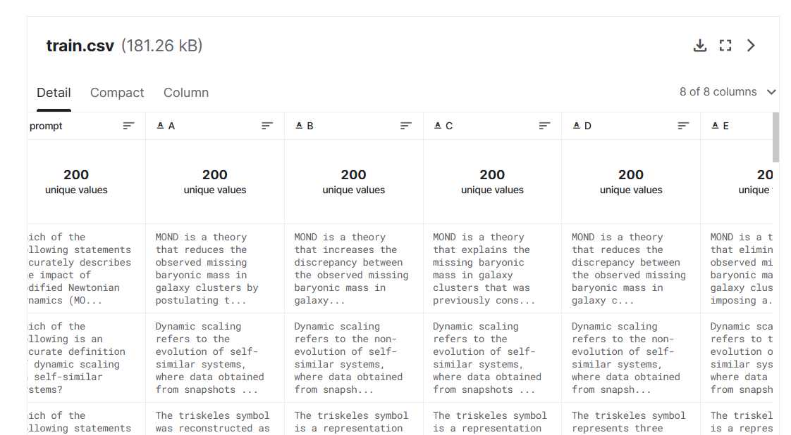
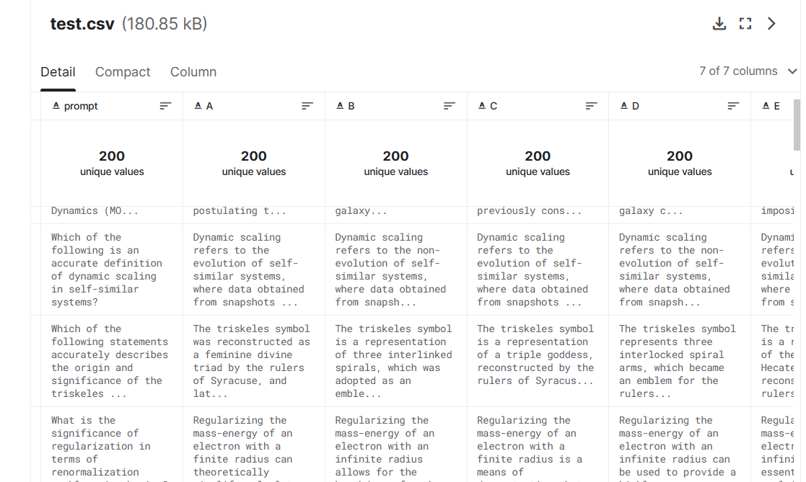
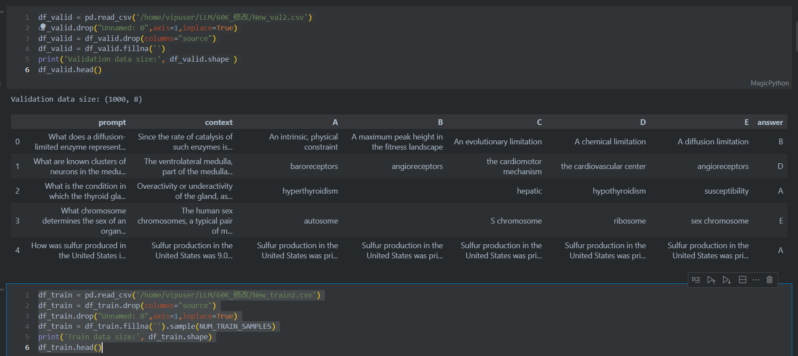
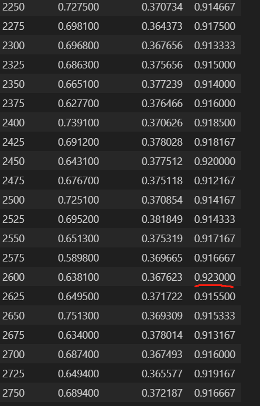
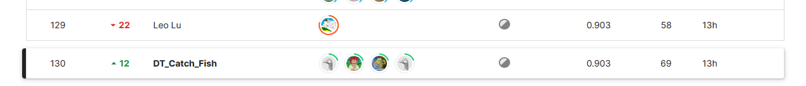
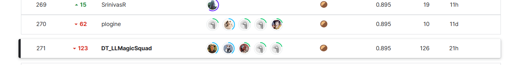

# kaggle竞赛LLM Science Exam比赛 首战 银牌和铜牌

**比赛链接** <https://www.kaggle.com/competitions/kaggle-llm-science-exam/overview>

## 一、比赛背景

**比赛目标**

受OpenBookQA数据集的启发，本次比赛挑战参赛者回答由大型语言模型编写的基于科学的困难问题。

您的工作将帮助研究人员更好地了解LLM自我测试的能力，以及LLM可以在资源受限的环境中运行的潜力。

**上下文**

随着大型语言模型功能范围的扩大，越来越多的研究领域正在使用LLM来表征自己。由于许多预先存在的NLP基准已被证明对于最先进的模型来说是微不足道的，因此也有有趣的工作表明LLM可用于创建更具挑战性的任务，以测试更强大的模型。

与此同时，量化和知识蒸馏等方法正被用来有效地缩小语言模型，并在更适度的硬件上运行它们。Kaggle环境提供了一个独特的视角来研究这个问题，因为提交受到GPU和时间限制的约束。

这个挑战的数据集是通过给出gpt3.5的文本片段来生成的，这些文本片段来自维基百科的一系列科学主题，并要求它写一个多项选择题（有一个已知的答案），然后过滤掉简单的问题。

现在我们估计在 Kaggle 上运行的最大模型大约有 10 亿个参数，而 gpt3.5 有 175 亿个参数。如果一个问答模型能够在一个由问题写作模型编写的测试中胜出，超过其大小的 10
倍，这将是一个真正有趣的结果;另一方面，如果一个较大的模型可以有效地难倒一个较小的模型，这对LLM进行基准测试和测试的能力具有令人信服的影响。 （纯机翻，觉得别扭可以直接看下图）


## 二、评估指标



如上图，这是一个评估任务，通常用于评估文本分类或标签预测模型的性能。任务的目标是通过给定一组问题（或文本段落），对每个问题进行多标签分类，即为每个问题预测最有可能的标签（通常是文本中的关键词或类别），并使用Mean Average
Precision @ 3（MAP@3）作为性能指标。MAP@3 越高说明模型性能越强

## 三、数据集

**数据描述**

您在本次比赛中的挑战是回答法学硕士编写的多项选择题。虽然用于生成这些问题的过程的细节并不公开，但我们提供了 200
个示例问题和答案，以显示格式，并大致了解测试集中的问题类型。但是，示例问题和测试集之间可能存在分布偏移，因此泛化为一组广泛问题的解决方案可能会表现得更好。每个问题由一个（问题）、5 个标记为 、、、 和
的选项以及标记的正确答案组成（这包含由生成的 LLM 定义的最正确答案的标签）。promptABCDEanswer

本次比赛使用隐藏测试。对提交的笔记本进行评分后，实际测试数据（包括示例提交）将提供给笔记本。测试集与提供的测试具有相同的格式.csv但有 ~4000 个可能不同的主题问题。

**数据集**

- **文件**


- train.csv - 一组 200 个问题，带有答案列
- test.csv - 测试集;你的任务是预测给定提示的前三个最可能的答案。注意：您在此处看到的测试数据只是训练数据的副本，没有答案。看不见的重新运行测试集由 ~4,000 个不同的提示组成。
- sample_submission.csv - 正确格式的示例提交文件


- **列**

- prompt- 所问问题的文本
- A- 备选方案A;如果此选项正确，则answerA
- B- 备选案文B;如果此选项正确，则answerB
- C- 备选方案C;如果此选项正确，则answerC
- D- 备选方案D;如果此选项正确，则answerD
- E- 备选方案E;如果此选项正确，则answerE
- answer- 最正确的答案，由生成的 LLM（、、、、 或 之一）定义。ABCDE




## 四、比赛思路与实现

**模型选择**

我们最开始使用的大语言模型LLM 是BRET，使用的训练数据是比赛方公布的200条训练集，训练代码和推理代码都是使用的比赛方公布的入门笔记本， 第一次提交的分数是 cv 0.830 LB 0.572。

在后面我们发现公布笔记本使用的模型都是deberta-v3-large，分数都普遍的高。

最终我们选择的预训练模型是deberta-v3-large

**比赛思路**

训练代码 https://www.kaggle.com/code/xiaocao123/how-to-train-open-book-model

推理代码 https://www.kaggle.com/code/xiaocao123/lb0-900

训练的数据我们使用的是 60k数据，整合了kaggle平台的公共数据集，其中大部分数据都是通过chatgpt3.5，和chatgpt4.0生成的

数据集拆分为 1000 个 STEM 问题进行验证和 ~59,000 个用于训练的问题。

并且采用了上下文的方式来训练模型

此挑战的数据集是通过提供从维基百科提取的一系列科学主题的 gpt3.5 文本片段，并要求其编写多项选择题（带有已知答案），然后过滤掉简单的问题来生成的。

有一个想法是通过使用语义搜索和维基百科将其转换为开卷科学考试，使这一挑战变得更容易一些。

**概述**

我们从维基百科获取最新转储的纯文本版本 (https://www.kaggle.com/datasets/jjinho/wikipedia-20230701)
然后，我们将使用句子转换器将提示转换为嵌入（特别是使用 all-MiniLM-L6-v2 模型） 我们还将创建所有维基百科文章的嵌入，并为了帮助我们，使用每篇文章的第一句话来提供更多上下文（再次使用 all-MiniLM-L6-v2）
然后，我们将使用 faiss 执行相似性搜索，以找到最有可能具有所需信息的 top-k 文章 然后，我们将获取这些文章的全文，并使用快速 blingfire 包将它们分成句子
同样，我们将获得这些句子的嵌入以及提示+答案选项的嵌入，并执行相似性搜索以获得每个问题的前k个匹配句子 然后，我们可以结合问题、答案选择和上下文来执行直接问答，或输入法学硕士 去做 启用离线使用 提高记忆效率 使速度更快
使用上下文信息来训练模型或使用 LLM 运行推理

### 训练的参数和模型冻结

**环境配置为**

    GPU 40G显存A100
    CUDA 11.0
    内存 32G
    python 3.8.5
    
    使用该代码训练模型最低GPU显存为24G

```python
training_args = TrainingArguments(
    warmup_ratio=0.1,
    learning_rate=2e-5,
    per_device_train_batch_size=2,
    per_device_eval_batch_size=4,
    num_train_epochs=2,
    report_to='none',
    output_dir=f'models{VER}',
    overwrite_output_dir=True,
    fp16=True,
    gradient_accumulation_steps=8,
    logging_steps=25,
    evaluation_strategy='steps',
    eval_steps=25,
    save_strategy="steps",
    save_steps=25,
    load_best_model_at_end=False,
    metric_for_best_model='map@3',
    lr_scheduler_type='cosine',
    weight_decay=0.01,
    save_total_limit=2,
)
```

- 使用gradient_accumlation_steps（模拟更大的批量大小）
- 使用gradient_checkpointing（使用磁盘来节省RAM）

- 冻结模型嵌入（减少了训练的权重）
- 冻结一些模型层（减少了训练的权重）
- 增加 LR 并减少 epochs（减少了工作量）

模型共24层，我们冻结了18层，并且冻结模型嵌入，MAX_INPUT为384

```python
import os

os.environ["CUDA_VISIBLE_DEVICES"] = "0"

from typing import Optional, Union
import pandas as pd, numpy as np, torch
from datasets import Dataset
from dataclasses import dataclass
from transformers import AutoTokenizer
from transformers import EarlyStoppingCallback
from transformers.tokenization_utils_base import PreTrainedTokenizerBase, PaddingStrategy
from transformers import AutoModelForMultipleChoice, TrainingArguments, Trainer

VER = 2
# TRAIN WITH SUBSET OF 60K
NUM_TRAIN_SAMPLES = 50_000
# PARAMETER EFFICIENT FINE TUNING
# PEFT REQUIRES 1XP100 GPU NOT 2XT4
USE_PEFT = False
# NUMBER OF LAYERS TO FREEZE 
# DEBERTA LARGE HAS TOTAL OF 24 LAYERS
FREEZE_LAYERS = 18
# BOOLEAN TO FREEZE EMBEDDINGS
FREEZE_EMBEDDINGS = True
# LENGTH OF CONTEXT PLUS QUESTION ANSWER
MAX_INPUT = 384
# HUGGING FACE MODEL
MODEL = '/home/vipuser/LLM/model'
```

写了一个判断，是否冻结嵌入和模型层数

```python
if FREEZE_EMBEDDINGS:
    print('Freezing embeddings.')
    for param in model.deberta.embeddings.parameters():
        param.requires_grad = False
if FREEZE_LAYERS > 0:
    print(f'Freezing {FREEZE_LAYERS} layers.')
    for layer in model.deberta.encoder.layer[:FREEZE_LAYERS]:
        for param in layer.parameters():
            param.requires_grad = False
```

**数据处理**

数据我们直接使用的公共数据集整合的数据集 60k，其中1000个验证数据和50000个训练数据

```python
df_valid = pd.read_csv('/home/vipuser/LLM/60K_修改/New_val2.csv')
df_valid.drop("Unnamed: 0", axis=1, inplace=True)
df_valid = df_valid.drop(columns="source")
df_valid = df_valid.fillna('')
print('Validation data size:', df_valid.shape)
# df_valid.head()

df_train = pd.read_csv('/home/vipuser/LLM/60K_修改/New_train2.csv')
df_train = df_train.drop(columns="source")
df_train.drop("Unnamed: 0", axis=1, inplace=True)
df_train = df_train.fillna('').sample(NUM_TRAIN_SAMPLES)
print('Train data size:', df_train.shape)
# df_train.head()
```



**评估指标**

评估指标我们使用的是比赛方要求的MAP@3

```python
def map_at_3(predictions, labels):
    map_sum = 0
    pred = np.argsort(-1 * np.array(predictions), axis=1)[:, :3]
    for x, y in zip(pred, labels):
        z = [1 / i if y == j else 0 for i, j in zip([1, 2, 3], x)]
        map_sum += np.sum(z)
    return map_sum / len(predictions)


def compute_metrics(p):
    predictions = p.predictions.tolist()
    labels = p.label_ids.tolist()
    return {"map@3": map_at_3(predictions, labels)}
```

**训练结果**

训练代码

```python
trainer = Trainer(
    model=model,
    args=training_args,
    tokenizer=tokenizer,
    data_collator=DataCollatorForMultipleChoice(tokenizer=tokenizer),
    train_dataset=tokenized_dataset,
    eval_dataset=tokenized_dataset_valid,
    compute_metrics=compute_metrics,
    # callbacks=[EarlyStoppingCallback(early_stopping_patience=5)],
)

trainer.train()
trainer.save_model(f'model_v{VER}')
```

训练成绩



看图，训练到2600步时，cv最高为0.923，训练的时间大约为7小时。

因为本次比赛要求笔记本运行的时间不能超过9小时，所以我们采取了在本地训练好模型，然后上传kaggle平台，直接加载模型进行推理，这样节省了kaggle每周的gpu时间，以及代码运行的时间。

想要获得好的成绩，我们的推理代码一样很重要

### 推理部分

使用简单的 TF-IDF 从两个数据集中检索每个给定问题的上下文。 我使用了 deberta-v3-large 模型，这使我们能够在 GPU 内存有限的情况下拥有更长的前缀上下文。
更具体地说，与许多公共笔记本不同，没有分割到句子级别，并且整个段落被检索并作为上下文传递给分类器。

我使用
主模型 deberta-v3-large 模型 单模为LB 0.831
后备模型，用于在主模型的首选输出置信度较低时进行预测。

后备模型 的笔记本我使用了4个模型进行均值融合也采用过加权融合和stacking融合。 每个模型的训练数据和参数都不一样

| 类型          | 公榜    | 私榜    | 时间  |
|-------------|-------|-------|-----|
| 均值融合        | 0.851 | 0.827 | 3h  |
| 加权融合        | 0.849 | 0.820 | 3h  |
| stacking融合  | 0.850 | 0.836 | 7h  |

可以看到 stacking融合在私榜上都要高，均值融合在公榜分数比较高，私榜在比赛的过程中不会出现。

因为笔记本有提交时间限制9h，其次我们不知道私榜成绩，最终选择了均值融合，公榜成绩最高。

下面是备用模型的融合模型的核心代码

```python
def softmax(x):
    e_x = np.exp(x - np.max(x, axis=-1, keepdims=True))
    return e_x / e_x.sum(axis=-1, keepdims=True)


def generate_openbook_output():
    test_df = pd.read_csv("test_context.csv")
    test_df.index = list(range(len(test_df)))
    test_df['id'] = list(range(len(test_df)))
    test_df["prompt"] = test_df["context"].apply(lambda x: x[:2300]) + " #### " + test_df["prompt"]
    test_df['answer'] = 'A'
    model_dir = "/kaggle/input/llm-science-run-context-2"
    tokenizer = AutoTokenizer.from_pretrained(model_dir)
    model = AutoModelForMultipleChoice.from_pretrained(model_dir).cuda()
    model.eval()

    # We'll create a dictionary to convert option names (A, B, C, D, E) into indices and back again
    options = 'ABCDE'
    indices = list(range(5))

    option_to_index = {option: index for option, index in zip(options, indices)}
    index_to_option = {index: option for option, index in zip(options, indices)}

    def preprocess(example):
        # The AutoModelForMultipleChoice class expects a set of question/answer pairs
        # so we'll copy our question 5 times before tokenizing
        first_sentence = [example['prompt']] * 5
        second_sentence = []
        for option in options:
            second_sentence.append(example[option])
        # Our tokenizer will turn our text into token IDs BERT can understand
        tokenized_example = tokenizer(first_sentence, second_sentence, truncation=True)
        tokenized_example['label'] = option_to_index[example['answer']]
        return tokenized_example

    tokenized_test_dataset = Dataset.from_pandas(
        test_df[['id', 'prompt', 'A', 'B', 'C', 'D', 'E', 'answer']].drop(columns=['id'])).map(preprocess,
                                                                                               remove_columns=['prompt',
                                                                                                               'A', 'B',
                                                                                                               'C', 'D',
                                                                                                               'E',
                                                                                                               'answer'])
    tokenized_test_dataset = tokenized_test_dataset.remove_columns(["__index_level_0__"])
    data_collator = DataCollatorForMultipleChoice(tokenizer=tokenizer)
    test_dataloader = DataLoader(tokenized_test_dataset, batch_size=1, shuffle=False, collate_fn=data_collator)

    test_predictions1 = []
    for batch in test_dataloader:
        for k in batch.keys():
            batch[k] = batch[k].cuda()
        with torch.no_grad():
            outputs = model(**batch)
        test_predictions1.append(outputs.logits.cpu().detach())

    test_predictions1 = torch.cat(test_predictions1)
    test_predictions1 = test_predictions1.numpy()
    del model, tokenizer

    # model_dir = "/kaggle/input/new-60k-model-6250/model_v2"
    model_dir = "/kaggle/input/my-model-v2/model_v2"
    tokenizer = AutoTokenizer.from_pretrained(model_dir)
    model = AutoModelForMultipleChoice.from_pretrained(model_dir).cuda()
    model.eval()
    test_predictions2 = []
    for batch in test_dataloader:
        for k in batch.keys():
            batch[k] = batch[k].cuda()
        with torch.no_grad():
            outputs = model(**batch)
        test_predictions2.append(outputs.logits.cpu().detach())

    test_predictions2 = torch.cat(test_predictions2)
    test_predictions2 = test_predictions2.numpy()
    del model, tokenizer

    model = AutoModelForMultipleChoice.from_pretrained(f"/kaggle/input/new-60k-model-6250/model_v2").cuda()
    model.eval()
    test_predictions3 = []
    for batch in test_dataloader:
        for k in batch.keys():
            batch[k] = batch[k].cuda()
        with torch.no_grad():
            outputs = model(**batch)
        test_predictions3.append(outputs.logits.cpu().detach())

    test_predictions3 = torch.cat(test_predictions3)
    test_predictions3 = test_predictions3.numpy()
    del model
    model = AutoModelForMultipleChoice.from_pretrained(f'/kaggle/input/my-1-epoch').cuda()
    model.eval()
    test_predictions4 = []
    for batch in test_dataloader:
        for k in batch.keys():
            batch[k] = batch[k].cuda()
        with torch.no_grad():
            outputs = model(**batch)
        test_predictions4.append(outputs.logits.cpu().detach())

    test_predictions4 = torch.cat(test_predictions4)
    test_predictions4 = test_predictions4.numpy()

    test_predictions = softmax(test_predictions1) + softmax(test_predictions2) + softmax(test_predictions3) + softmax(
        test_predictions4)
    predictions_as_ids = np.argsort(-test_predictions, 1)
    # predictions_as_ids = np.argsort(-test_predictions, 1)

    predictions_as_answer_letters = np.array(list('ABCDE'))[predictions_as_ids]
    # predictions_as_answer_letters[:3]

    predictions_as_string = test_df['prediction'] = [
        ' '.join(row) for row in predictions_as_answer_letters[:, :3]
    ]

    submission = test_df[['id', 'prediction']]
    submission.to_csv('submission_backup.csv', index=False)
```

通过将多个模型的预测结果合并来获得最终的预测。具体的融合方法是通过Softmax函数将每个模型的预测结果转化为概率分布，然后对多个模型的概率分布进行相加来得到最终的融合结果。


在主推理代码中，我们加载备用模型生成的csv文件
```python
from util_openbook import get_contexts, generate_openbook_output
import pickle

get_contexts()
generate_openbook_output()

import pandas as pd
backup_model_predictions = pd.read_csv("submission_backup.csv")

import numpy as np
import pandas as pd 
from datasets import load_dataset, load_from_disk
from sklearn.feature_extraction.text import TfidfVectorizer
import torch
from transformers import LongformerTokenizer, LongformerForMultipleChoice
import transformers
import pandas as pd
import pickle
import numpy as np
import matplotlib.pyplot as plt
from tqdm import tqdm
import unicodedata

import os
```
```python
def SplitList(mylist, chunk_size):
    return [mylist[offs:offs+chunk_size] for offs in range(0, len(mylist), chunk_size)]

def get_relevant_documents_parsed(df_valid):
    df_chunk_size=600
    paraphs_parsed_dataset = load_from_disk("/kaggle/working/all-paraphs-parsed-expanded")
    modified_texts = paraphs_parsed_dataset.map(lambda example:
                                             {'temp_text':
                                              f"{example['title']} {example['section']} {example['text']}".replace('\n'," ").replace("'","")},
                                             num_proc=2)["temp_text"]
    
    all_articles_indices = []
    all_articles_values = []
    for idx in tqdm(range(0, df_valid.shape[0], df_chunk_size)):
        df_valid_ = df_valid.iloc[idx: idx+df_chunk_size]
    
        articles_indices, merged_top_scores = retrieval(df_valid_, modified_texts)
        all_articles_indices.append(articles_indices)
        all_articles_values.append(merged_top_scores)
        
    article_indices_array =  np.concatenate(all_articles_indices, axis=0)
    articles_values_array = np.concatenate(all_articles_values, axis=0).reshape(-1)
    
    top_per_query = article_indices_array.shape[1]
    articles_flatten = [(
                         articles_values_array[index],
                         paraphs_parsed_dataset[idx.item()]["title"],
                         paraphs_parsed_dataset[idx.item()]["text"],
                        )
                        for index,idx in enumerate(article_indices_array.reshape(-1))]
    retrieved_articles = SplitList(articles_flatten, top_per_query)
    return retrieved_articles


def get_relevant_documents(df_valid):
    df_chunk_size=800
    
    cohere_dataset_filtered = load_from_disk("/kaggle/working/stem-wiki-cohere-no-emb")
    modified_texts = cohere_dataset_filtered.map(lambda example:
                                             {'temp_text':
                                              unicodedata.normalize("NFKD", f"{example['title']} {example['text']}").replace('"',"")},
                                             num_proc=2)["temp_text"]
    
    all_articles_indices = []
    all_articles_values = []
    for idx in tqdm(range(0, df_valid.shape[0], df_chunk_size)):
        df_valid_ = df_valid.iloc[idx: idx+df_chunk_size]
    
        articles_indices, merged_top_scores = retrieval(df_valid_, modified_texts)
        all_articles_indices.append(articles_indices)
        all_articles_values.append(merged_top_scores)
        
    article_indices_array =  np.concatenate(all_articles_indices, axis=0)
    articles_values_array = np.concatenate(all_articles_values, axis=0).reshape(-1)
    
    top_per_query = article_indices_array.shape[1]
    articles_flatten = [(
                         articles_values_array[index],
                         cohere_dataset_filtered[idx.item()]["title"],
                         unicodedata.normalize("NFKD", cohere_dataset_filtered[idx.item()]["text"]),
                        )
                        for index,idx in enumerate(article_indices_array.reshape(-1))]
    retrieved_articles = SplitList(articles_flatten, top_per_query)
    return retrieved_articles


def retrieval(df_valid, modified_texts):
    
    corpus_df_valid = df_valid.apply(lambda row:
                                     f'{row["prompt"]}\n{row["prompt"]}\n{row["prompt"]}\n{row["A"]}\n{row["B"]}\n{row["C"]}\n{row["D"]}\n{row["E"]}',
                                     axis=1).values
    vectorizer1 = TfidfVectorizer(ngram_range=(1,2),
                                 token_pattern=r"(?u)\b[\w/.-]+\b|!|/|\?|\"|\'",
                                 stop_words=stop_words)
    vectorizer1.fit(corpus_df_valid)
    vocab_df_valid = vectorizer1.get_feature_names_out()
    vectorizer = TfidfVectorizer(ngram_range=(1,2),
                                 token_pattern=r"(?u)\b[\w/.-]+\b|!|/|\?|\"|\'",
                                 stop_words=stop_words,
                                 vocabulary=vocab_df_valid)
    vectorizer.fit(modified_texts[:500000])
    corpus_tf_idf = vectorizer.transform(corpus_df_valid)
    
    print(f"length of vectorizer vocab is {len(vectorizer.get_feature_names_out())}")

    chunk_size = 100000
    top_per_chunk = 10
    top_per_query = 10

    all_chunk_top_indices = []
    all_chunk_top_values = []

    for idx in tqdm(range(0, len(modified_texts), chunk_size)):
        wiki_vectors = vectorizer.transform(modified_texts[idx: idx+chunk_size])
        temp_scores = (corpus_tf_idf * wiki_vectors.T).toarray()
        chunk_top_indices = temp_scores.argpartition(-top_per_chunk, axis=1)[:, -top_per_chunk:]
        chunk_top_values = temp_scores[np.arange(temp_scores.shape[0])[:, np.newaxis], chunk_top_indices]

        all_chunk_top_indices.append(chunk_top_indices + idx)
        all_chunk_top_values.append(chunk_top_values)

    top_indices_array = np.concatenate(all_chunk_top_indices, axis=1)
    top_values_array = np.concatenate(all_chunk_top_values, axis=1)
    
    merged_top_scores = np.sort(top_values_array, axis=1)[:,-top_per_query:]
    merged_top_indices = top_values_array.argsort(axis=1)[:,-top_per_query:]
    articles_indices = top_indices_array[np.arange(top_indices_array.shape[0])[:, np.newaxis], merged_top_indices]
    
    return articles_indices, merged_top_scores


def prepare_answering_input(
        tokenizer, 
        question,  
        options,   
        context,   
        max_seq_length=4096,
    ):
    c_plus_q   = context + ' ' + tokenizer.bos_token + ' ' + question
    c_plus_q_4 = [c_plus_q] * len(options)
    tokenized_examples = tokenizer(
        c_plus_q_4, options,
        max_length=max_seq_length,
        padding="longest",
        truncation=False,
        return_tensors="pt",
    )
    input_ids = tokenized_examples['input_ids'].unsqueeze(0)
    attention_mask = tokenized_examples['attention_mask'].unsqueeze(0)
    example_encoded = {
        "input_ids": input_ids.to(model.device.index),
        "attention_mask": attention_mask.to(model.device.index),
    }
    return example_encoded
```


SplitList(mylist, chunk_size)：将一个列表切分成多个具有指定大小的子列表，这个函数用于拆分数据集。

get_relevant_documents_parsed(df_valid)：从一个已解析的文本数据集中获取相关文档。这个函数首先加载一个已解析的文本数据集，然后对验证数据集中的每个查询进行文档检索，返回一组相关文档。

get_relevant_documents(df_valid)：与前一个函数类似，但这次从不同的文本数据集中获取相关文档。它加载另一个文本数据集并执行文档检索。

retrieval(df_valid, modified_texts)：这个函数执行文档检索过程。它将验证数据集中的查询和选项与已解析文本进行比较，并计算相关性得分。函数返回相关文档的索引和得分。

prepare_answering_input(tokenizer, question, options, context, max_seq_length)：这个函数用于准备回答问题的输入。它将问题、选项和上下文拼接在一起，并进行适当的编码和分词，以便用于问题回答模型的输入。

**构建好函数之后，处理好数据，我们直接写一个预测代码，其中使用阈值低于0.4 来决定使用备用模型进行预测**

```python
predictions = []
submit_ids = []

for index in tqdm(range(df_valid.shape[0])):
    columns = df_valid.iloc[index].values
    submit_ids.append(columns[0])
    question = columns[1]
    options = [columns[2], columns[3], columns[4], columns[5], columns[6]]
    context1 = f"{retrieved_articles[index][-4][2]}\n{retrieved_articles[index][-3][2]}\n{retrieved_articles[index][-2][2]}\n{retrieved_articles[index][-1][2]}"
    context2 = f"{retrieved_articles_parsed[index][-3][2]}\n{retrieved_articles_parsed[index][-2][2]}\n{retrieved_articles_parsed[index][-1][2]}"
    inputs1 = prepare_answering_input(
        tokenizer=tokenizer, question=question,
        options=options, context=context1,
        )
    inputs2 = prepare_answering_input(
        tokenizer=tokenizer, question=question,
        options=options, context=context2,
        )
    
    with torch.no_grad():
        outputs1 = model(**inputs1)    
        losses1 = -outputs1.logits[0].detach().cpu().numpy()
        probability1 = torch.softmax(torch.tensor(-losses1), dim=-1)
        
    with torch.no_grad():
        outputs2 = model(**inputs2)
        losses2 = -outputs2.logits[0].detach().cpu().numpy()
        probability2 = torch.softmax(torch.tensor(-losses2), dim=-1)
        
    probability_ = (probability1 + probability2)/2

    if probability_.max() > 0.4:
        predict = np.array(list("ABCDE"))[np.argsort(probability_)][-3:].tolist()[::-1]
    else:
        predict = backup_model_predictions.iloc[index].prediction.replace(" ","")
    predictions.append(predict)

predictions = [" ".join(i) for i in predictions]
pd.DataFrame({'id':submit_ids,'prediction':predictions}).to_csv('submission.csv', index=False)
```
最后生成csv提交kaggle平台


我们一共是2队参加比赛

    一队的最高成绩为 公榜0.908 私榜0.90 但选择的笔记本私榜成绩为0.895 排名271 铜牌
    二队的最高成绩为 公榜0.909 私榜0.904 但选择的笔记本私榜成绩为0.903 排名130 银牌





## 数据集下载链接为：

https://www.kaggle.com/datasets/cody11null/split-60k-data

模型可以直接复制我的kaggle公开代码中的模型以及推理代码还有备用模型配置文件uttil_openbook.py。