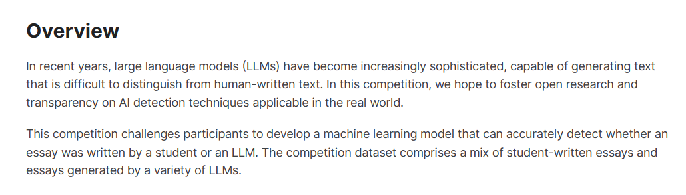
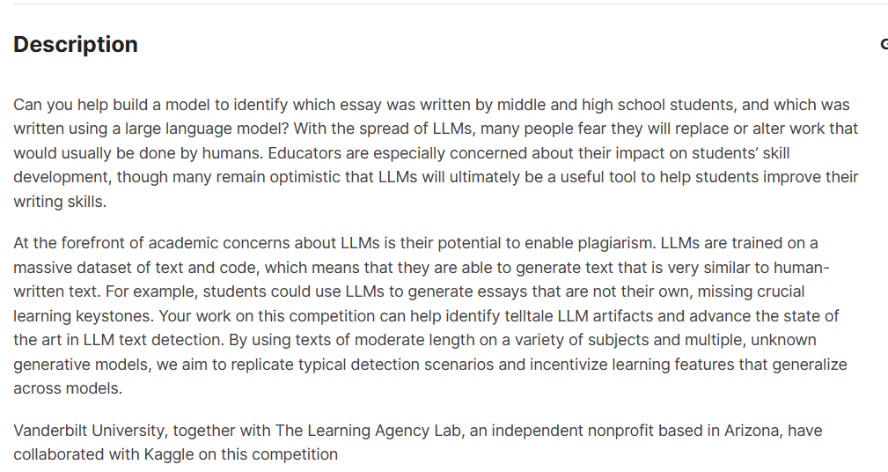
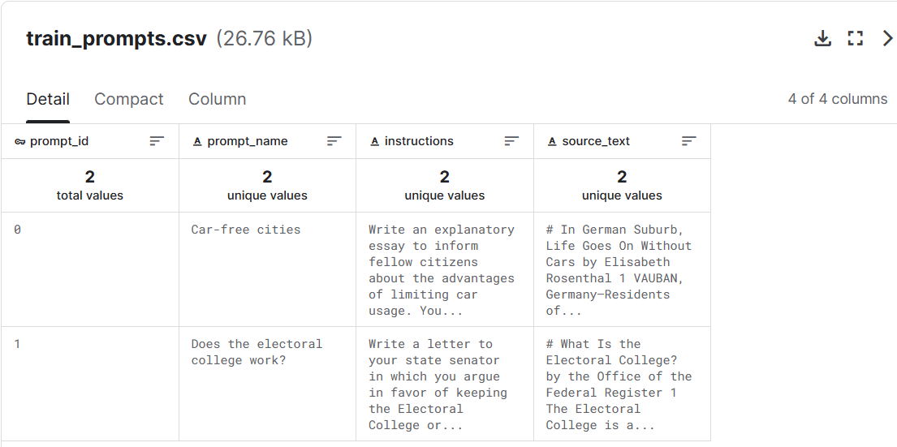
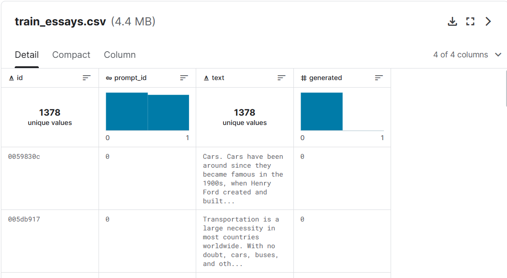
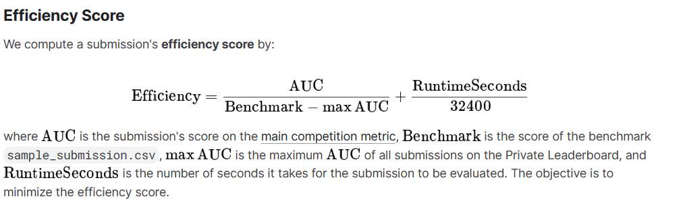
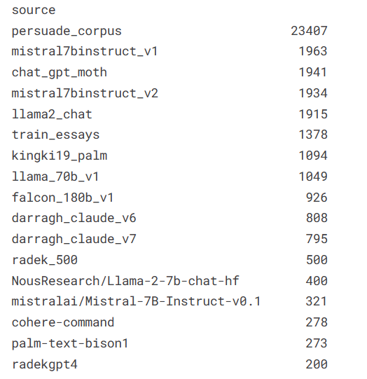
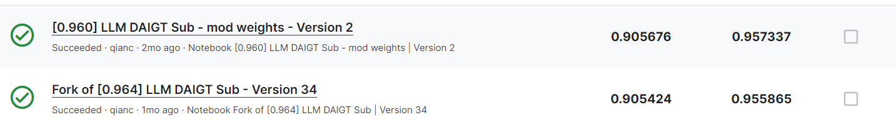
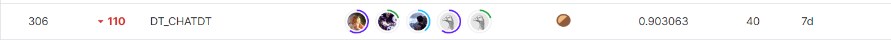
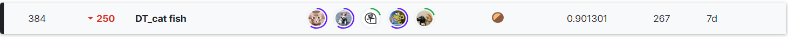

# kaggle竞赛LLM - Detect AI Generated Text比赛 银牌铜牌方案

**比赛链接** <https://www.kaggle.com/competitions/llm-detect-ai-generated-text/overview>

## 一、比赛背景

**比赛概述**

近年来，大型语言模型（LLM）变得越来越复杂，能够生成难以与人类书写的文本区分开的文本。 在本次竞赛中，我们希望促进适用于现实世界的人工智能检测技术的开放研究和透明度。

该竞赛要求参赛者开发一种机器学习模型，该模型可以准确检测论文是由学生还是LLM大语言模型撰写的。 竞赛数据集包含学生撰写的论文和各种LLM大语言模型生成的论文。

**描述**

你能帮忙建立一个模型来识别哪些论文是中学生写的，哪些是用大语言模型写的吗？ 随着法学硕士的传播，许多人担心它们会取代或改变通常由人类完成的工作。
教育工作者特别关心它们对学生技能发展的影响，尽管许多人仍然乐观地认为法学硕士最终将成为帮助学生提高写作技能的有用工具。

学术界对法学硕士最关心的问题是它们可能导致剽窃。 法学硕士接受过大量文本和代码数据集的训练，这意味着他们能够生成与人类编写的文本非常相似的文本。 例如，学生可以使用法学硕士来撰写不属于自己的论文，从而错过了关键的学习基石。
您在本次竞赛中的工作可以帮助识别 LLM 文物并推进 LLM 文本检测的最新技术。 通过在各种主题和多个未知的生成模型上使用中等长度的文本，我们的目标是复制典型的检测场景并激励跨模型泛化的学习特征。

范德比尔特大学以及位于亚利桑那州的独立非营利组织 The Learning Agency Lab 与 Kaggle 合作开展了本次竞赛。 （纯机翻，觉得别扭可以直接看下图）



## 二、评估指标



如上图，提交的内容根据预测概率与观察目标之间的 ROC 曲线下面积进行评估。

## 三、数据集

**数据描述**

竞赛数据集包含约 10,000 篇论文，其中一些是由学生撰写的，一些是由各种大型语言模型 (LLM) 生成的。 竞赛的目的是确定论文是否由法学硕士撰写。

所有论文都是针对七个论文提示之一而写的。 在每个提示中，学生都被要求阅读一篇或多篇源文本，然后写下答案。 在生成论文时，相同的信息可能会也可能不会作为法学硕士的输入提供。

来自两个提示的文章组成了训练集； 其余的文章组成了隐藏的测试集。 几乎所有的训练集论文都是由学生撰写的，只有少数生成的论文作为示例。 您可能希望生成更多论文用作训练数据。

请注意，这是一场代码竞赛。 test_essays.csv 中的数据只是虚拟数据，可帮助您编写解决方案。 当您提交的内容被评分时，此示例测试数据将替换为完整的测试集。 测试集中约有 9,000
篇论文，包括学生撰写的论文和法学硕士生成的论文。

**数据集**

- **文件**


- train.csv - 有1378条数据，根据2个提示词生成的文章
- train_prompts.csv - 提示词
- sample_submission.csv - 正确格式的示例提交文件


- **列**

id - 每篇文章的唯一标识符。 Prompt_id - 标识文章所针对的提示。 text - 论文文本本身。 generated - 论文是由学生撰写（0）还是由法学硕士生成（1）。 该字段是目标，不存在于 test_essays.csv
中。

train_prompts.csv - 文章是针对这些领域的信息而撰写的。 Prompt_id - 每个提示的唯一标识符。 Prompt_name - 提示的标题。




## 四、比赛思路与实现

**模型选择**

我们最开始使用的是Mistral-7B模型来做一个分类，但公共分数LB为0.845，后面我们尝试了机器学习模型，逻辑回归和SGD，LB达到了0.895,
后续我们一直使用的模型为机器学习模型，因为公开的LLM模型分数都普遍的低，最终我们选择了SGD，MultinomialNB，LGBMClassifier，CatBoostClassifier机器学习模型
并使用VotingClassifier投票法来集成4个机器学习模型，最高LB为0.965。

**比赛思路**

训练代码，推理代码 https://www.kaggle.com/code/xiaocao123/0-960-llm-daigt-sub-mod-weights?scriptVersionId=153840596

训练的数据我们使用的是 train_v2_drcat_02.csv数据，整合了kaggle平台的公共数据集，其中数据都是通过各种型号的LLM模型生成的，如以下图


数据集为3w条数据

**概述**


早期我们采用机器学习来做,使用7个提示词，每个提示词抽1500条数据作为验证集，使用TF-ide来做词嵌入，n-gram为（1，3） 本地cv auc为0.99，但提交的LB只有0.902,之后不断的探索，发现
比赛方用的数据集可能设置了噪声，比如错别字， 所以我们使用了 `language_tool_python` 库来修正测试集的错别字，提交后，发现LB提升到了0.918，
之后不断的优化模型的权重和组合，以及TF-ide的n-gram为（3，5）LB直接达到0.941，

我们也使用了kaggle大佬的BBPE算法，鉴于对提示和文本来源的了解，大多数信息获取来自分布差异，通常是由人为或人为引入的错别字引起的。经典的 tf-idf
在单词级别表现良好，但当涉及到拼写错误时，我们面临着一个两难境地：要么通过额外的预处理步骤来修复它们，要么与可能降低简单机器学习模型效率的大量词汇量作斗争。
为了应对这一挑战，我专注于将错别字作为词汇表中的独立元素来捕捉，尤其是词干和词后缀。在探索解决方案时，我尝试了字符级 ngram，但这种方法存在前面提到的问题：词汇量膨胀。
最后，实现了字节对编码作为分词器，因为它在创建词汇本身之前还会考虑有关实际语料库的一些统计数据。 它基本上从每个字符开始作为字符级词汇，然后根据您的词汇量构建最常见的词汇。

使用BBPE算法后，LB达到了0.946,我们使用optuna来实现自动搜索最优模型参数，LB再次提升到0.961,最后对train_v2_drcat_02.csv进行过滤，删除不必要的数据，LB达到最终的0.964
之后使用distilroberta LLM训练 单模型LB为0.927 和我们的LB 0.964机器学习模型进行 加权融合 权重为0.94 0.06，LB达到最终的0.965

优化 使用 Levenshtein 距离进行纠错，搜索距离 1，
当有一个更正的单词时，更正它。 尝试修复本次讨论中提到的奇怪的大量字符替换，以及这个
计算距离“1”内所有单词的所有建议编辑（插入、删除、替换特定字母），
获取最频繁的，如果其频率超过文档中所有单词的 6%，则再次搜索 Levenshtein 距离，但使用自定义成本规范：最频繁的编辑成本是默认编辑成本的 10%。这样，我修复了讨论中提到的大多数“字母混淆”。

### 训练的模型和融合

**环境配置为**

    GPU 16G显存P100
    CUDA 11.0
    内存 32G
    python 3.8.5


**数据处理**

数据我们直接使用的公共数据集整合的数据集 40k

使用 Levenshtein 距离进行纠错test.csv
```python
import re
from collections import defaultdict

def sentence_correcter(text, lev_search, max_distance=1):
    word_list = re.findall(r'\b\w+\b|[.,\s]', text)
    correct_words = {}
    wrong_words = []
    cache = {}

    for word in word_list:
        if len(word) > 2 and word not in cache:
            # 先检查单词是否正确
            if not lev_search.find(word):
                result = lev_search.find_dist(word, max_distance=max_distance)
                result = list(result.__dict__['words'].values())

                # 缓存结果
                cache[word] = result[0].word if result else word

                # 如果是错误的单词，加入到列表中
                if cache[word] != word:
                    wrong_words.append(word)
            else:
                cache[word] = word
        else:
            cache[word] = word

        correct_words[word] = cache[word]

    # 计算错误单词的字符替换频率
    dict_freq = defaultdict(int)
    for wrong_word in wrong_words:
        result = lev_search.find_dist(wrong_word, max_distance=max_distance)
        result = list(result.__dict__['words'].values())

        if result:
            updates = result[0].updates
            if updates:
                parts = str(updates[0]).split(" -> ")
                if len(parts) == 2:
                    dict_freq[(parts[0], parts[1])] += 1

    # 应用高级校正逻辑（如果适用）
    if dict_freq:
        max_key = max(dict_freq, key=dict_freq.get)
        count = dict_freq[max_key]

        if count > 0.06 * len(text.split()):
            gec = GranularEditCostConfig(default_cost=10, edit_costs=[EditCost(max_key[0], max_key[1], 1)])

            for wrong_word in wrong_words:
                result = lev_search.find_dist(wrong_word, max_distance=9, edit_cost_config=gec)
                result = list(result.__dict__['words'].values())

                if result:
                    correct_words[wrong_word] = result[0].word

    # 重建并返回纠正后的句子
    return "".join(correct_words[word] for word in word_list)
def process_row(row):
    return sentence_correcter(row['text'],lev_search)
import time
from concurrent.futures import ThreadPoolExecutor
# from collections import defaultdict
s=time.time()
# 使用ThreadPoolExecutor并行处理
with ThreadPoolExecutor(max_workers=5) as executor:
    # 使用map函数来应用process_row到每一行
#     results = list(executor.map(process_row, train.to_dict('records')))
    results1 =list(executor.map(process_row, test.to_dict('records')))
# 将结果存回DataFrame
# train['text'] = results
test["text"]= results1
e=time.time()
print("time :",e-s)

```

使用BBPE处理特征

```python
LOWERCASE = False
VOCAB_SIZE = 30522  #30522
# Creating Byte-Pair Encoding tokenizer
raw_tokenizer = Tokenizer(models.BPE(unk_token="[UNK]"))
raw_tokenizer.normalizer = normalizers.Sequence([normalizers.NFC()] + [normalizers.Lowercase()] if LOWERCASE else [])
raw_tokenizer.pre_tokenizer = pre_tokenizers.ByteLevel()
special_tokens = ["[UNK]", "[PAD]", "[CLS]", "[SEP]", "[MASK]"]
trainer = trainers.BpeTrainer(vocab_size=VOCAB_SIZE, special_tokens=special_tokens)
dataset = Dataset.from_pandas(test[['text']])
def train_corp_iter(): 
    for i in range(0, len(dataset), 1000):
        yield dataset[i : i + 1000]["text"]
raw_tokenizer.train_from_iterator(train_corp_iter(), trainer=trainer)
tokenizer = PreTrainedTokenizerFast(
    tokenizer_object=raw_tokenizer,
    unk_token="[UNK]",
    pad_token="[PAD]",
    cls_token="[CLS]",
    sep_token="[SEP]",
    mask_token="[MASK]",
)
tokenized_texts_test = []

for text in tqdm(test['text'].tolist()):
    tokenized_texts_test.append(tokenizer.tokenize(text))

tokenized_texts_train = []

for text in tqdm(train['text'].tolist()):
    tokenized_texts_train.append(tokenizer.tokenize(text))
```

使用 TF-ide再次构建特征
```python
def dummy(text):
    return text
vectorizer = TfidfVectorizer(ngram_range=(3, 5), lowercase=False, sublinear_tf=True, analyzer = 'word',
    tokenizer = dummy,
    preprocessor = dummy,
    token_pattern = None, strip_accents='unicode')

vectorizer.fit(tokenized_texts_test)

# Getting vocab
vocab = vectorizer.vocabulary_

print(vocab)

vectorizer = TfidfVectorizer(ngram_range=(3, 5), lowercase=False, sublinear_tf=True, vocabulary=vocab,
                            analyzer = 'word',
                            tokenizer = dummy,
                            preprocessor = dummy,
                            token_pattern = None, strip_accents='unicode'
                            )

tf_train = vectorizer.fit_transform(tokenized_texts_train)
tf_test = vectorizer.transform(tokenized_texts_test)
```
使用第一个TF-ide构建测试集词汇表，加入到第二个TF-ide中进行词嵌入


**评估指标**

评估指标我们使用的是比赛方要求的AUC


使用optuna自动调参

```python
import sys
import gc

import pandas as pd
from sklearn.model_selection import StratifiedKFold
import numpy as np
from sklearn.metrics import roc_auc_score
import numpy as np
from lightgbm import LGBMClassifier
from sklearn.feature_extraction.text import TfidfVectorizer

from tokenizers import (
    decoders,
    models,
    normalizers,
    pre_tokenizers,
    processors,
    trainers,
    Tokenizer,
)

from datasets import Dataset
from tqdm.auto import tqdm
from transformers import PreTrainedTokenizerFast

from sklearn.linear_model import SGDClassifier
from sklearn.naive_bayes import MultinomialNB
from sklearn.ensemble import VotingClassifier
import optuna
from lightgbm import LGBMClassifier
from sklearn.model_selection import train_test_split
from sklearn.metrics import roc_auc_score
from catboost import CatBoostClassifier

# /kaggle/input/daigt-submission-mocked-up/daigt-v2-train-dataset-splited-test-size-0.25-random-state-0/sample_submission.csv
datapath = '/kaggle/input/daigt-submission-mocked-up/daigt-v2-train-dataset-splited-test-size-9000-random-state-0'
test = pd.read_csv(
    f'{datapath}/test_easays.csv'
)
sub = pd.read_csv(
    f'{datapath}/sample_submission.csv'
)
# org_train = pd.read_csv('/kaggle/input/llm-detect-ai-generated-text/train_essays.csv')

train = pd.read_csv(
    f"{datapath}/train.csv", sep=','
)

test = test.iloc[:4500]
sub = sub.iloc[:4500]

train = train.drop_duplicates(subset=['text'])
train.reset_index(drop=True, inplace=True)

LOWERCASE = False
VOCAB_SIZE = 30522

# Creating Byte-Pair Encoding tokenizer
raw_tokenizer = Tokenizer(models.BPE(unk_token="[UNK]"))
# Adding normalization and pre_tokenizer
raw_tokenizer.normalizer = normalizers.Sequence([normalizers.NFC()] + [normalizers.Lowercase()] if LOWERCASE else [])
raw_tokenizer.pre_tokenizer = pre_tokenizers.ByteLevel()
# Adding special tokens and creating trainer instance
special_tokens = ["[UNK]", "[PAD]", "[CLS]", "[SEP]", "[MASK]"]
trainer = trainers.BpeTrainer(vocab_size=VOCAB_SIZE, special_tokens=special_tokens)
# Creating huggingface dataset object
dataset = Dataset.from_pandas(test[['text']])
def train_corp_iter(): 
    for i in range(0, len(dataset), 1000):
        yield dataset[i : i + 1000]["text"]
raw_tokenizer.train_from_iterator(train_corp_iter(), trainer=trainer)
tokenizer = PreTrainedTokenizerFast(
    tokenizer_object=raw_tokenizer,
    unk_token="[UNK]",
    pad_token="[PAD]",
    cls_token="[CLS]",
    sep_token="[SEP]",
    mask_token="[MASK]",
)
tokenized_texts_test = []

for text in tqdm(test['text'].tolist()):
    tokenized_texts_test.append(tokenizer.tokenize(text))

tokenized_texts_train = []

for text in tqdm(train['text'].tolist()):
    tokenized_texts_train.append(tokenizer.tokenize(text))
    
y_train = train['label'].values
del train
gc.collect()

def dummy(text):
    return text
vectorizer = TfidfVectorizer(ngram_range=(3, 5), lowercase=False, sublinear_tf=True, analyzer = 'word',
    tokenizer = dummy,
    preprocessor = dummy,
    token_pattern = None,
    strip_accents='unicode'
)

vectorizer.fit(tokenized_texts_test)

# Getting vocab
vocab = vectorizer.vocabulary_


vectorizer = TfidfVectorizer(
    ngram_range=(3, 5), lowercase=False, sublinear_tf=True, vocabulary=vocab,
    analyzer = 'word',
    tokenizer = dummy,
    preprocessor = dummy,
    token_pattern = None, strip_accents='unicode'
)

tf_train = vectorizer.fit_transform(tokenized_texts_train)
tf_test = vectorizer.transform(tokenized_texts_test)

del vectorizer
gc.collect()
y_true = pd.read_csv(f"{datapath}/test_true_labels.csv").iloc[:4500]

from lightgbm.callback import early_stopping
def objective_111(trial):
    # 定义超参数搜索空间
    params = {
    'iterations': 2000,
    'verbose': 0,
    'learning_rate': trial.suggest_float('learning_rate', 0.005, 0.01),
    'subsample': trial.suggest_float('subsample', 0.3, 0.6),
    'allow_const_label':True,
    'loss_function':'CrossEntropy'

    }

    # 初始化LightGBM模型
    catboost_model = CatBoostClassifier(**params)

    # 训练模型
    catboost_model.fit(tf_train, y_train, eval_set=[(tf_test, y_true["generated"])],early_stopping_rounds=100, verbose=False)

    # 验证模型
    y_pred = catboost_model.predict_proba(tf_test)[:, 1]

    # 计算AUC作为目标函数值
    auc = roc_auc_score(y_true["generated"], y_pred)
    print(f'Trial AUC: {auc}')
    return auc

study = optuna.create_study(direction='maximize')  # 'maximize'表示我们希望AUC越高越好
study.optimize(objective_111, n_trials=20)  # 运行100次试验，可以根据需要调整次数

# 打印最佳超参数
print('Best trial:')
trial = study.best_trial

print('AUC: {}'.format(trial.value))
print("Best hyperparameters: {}".format(trial.params))


```


训练代码

```python
    clf = MultinomialNB(alpha=0.021)
    sgd_model = SGDClassifier(max_iter=8000, tol=1e-4, loss="modified_huber") #8000 
    p6={'n_iter': 2500,'verbose': -1,'objective': 'cross_entropy','metric': 'auc', #2500
        'learning_rate': 0.00581909898961407, 'colsample_bytree': 0.78,
        'colsample_bynode': 0.8,
        'lambda_l1': 4.562963348932286, 
        'lambda_l2': 2.97485, 'min_data_in_leaf': 115, 'max_depth': 23, 'max_bin': 898
       }
    lgb=LGBMClassifier(**p6)
    cat=CatBoostClassifier(iterations=2000, #2000
                           verbose=0,
#                            l2_leaf_reg=6.6591278779517808,
                           learning_rate=0.005599066836106983,
                           subsample = 0.35, #0.4
                           allow_const_label=True,loss_function = 'CrossEntropy')
    weights = [0.1,0.31,0.28,0.67]
 
    ensemble = VotingClassifier(estimators=[('mnb',clf),
                                            ('sgd', sgd_model),
                                            ('lgb',lgb), 
                                            ('cat', cat)
                                           ],
                                weights=weights, voting='soft', n_jobs=-1)
    ensemble.fit(tf_train, y_train)
    gc.collect()
    final_preds = ensemble.predict_proba(tf_test)[:,1]
    final_preds=final_preds*0.93+probs*0.07
    sub['generated'] = final_preds
    sub.to_csv('submission.csv', index=False)
    sub

```

- 使用VotingClassifier投票法集成（集成4个模型）


训练成绩

本地 cv0.999

LB最高



最后生成csv提交kaggle平台

我们一共是2队参加比赛

    一队的最高成绩为 公榜0.9657 私榜0.905 但选择的笔记本私榜成绩为0.901 排名384 铜牌
    二队的最高成绩为 公榜0.964 私榜0.903 但选择的笔记本私榜成绩为0.903 排名306 银牌





