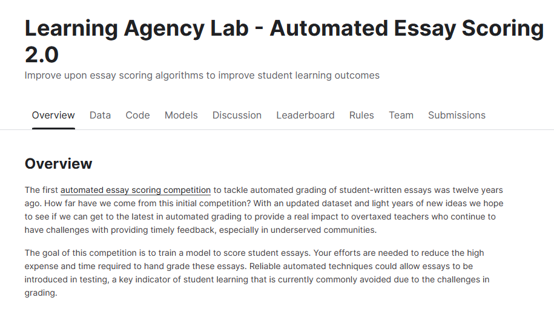
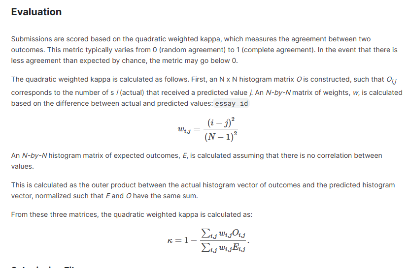
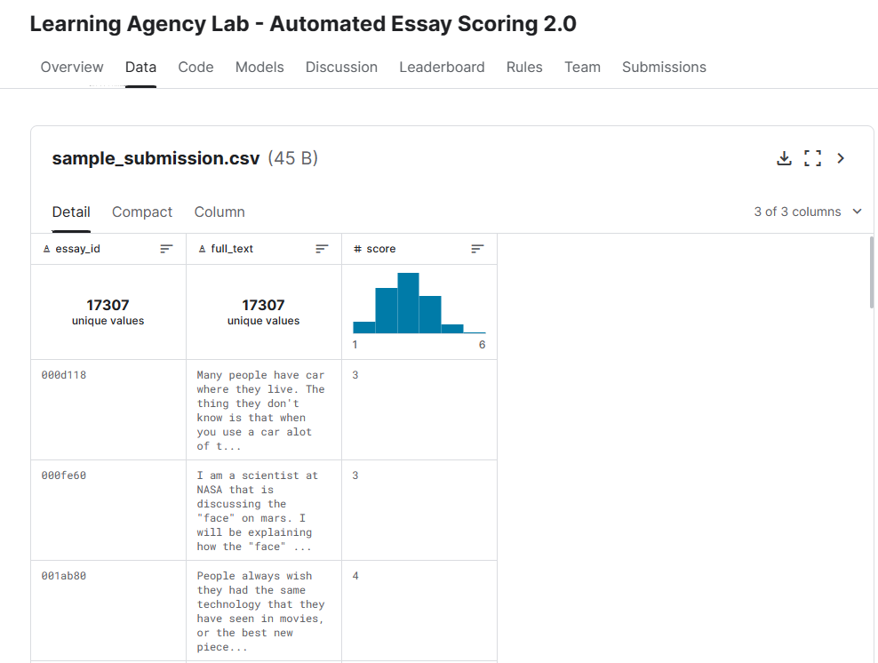
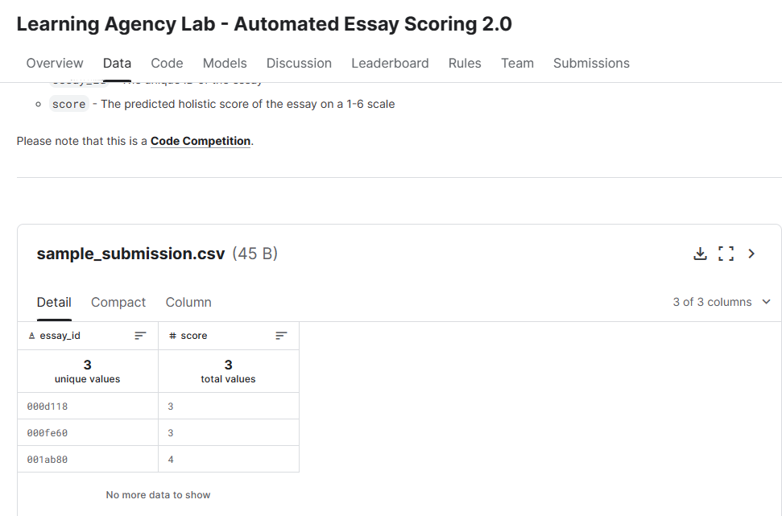
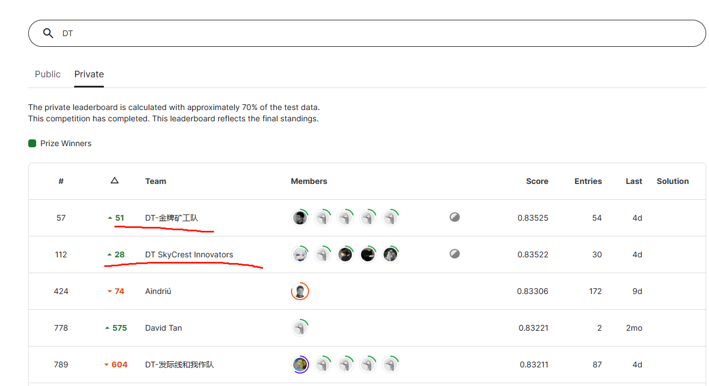
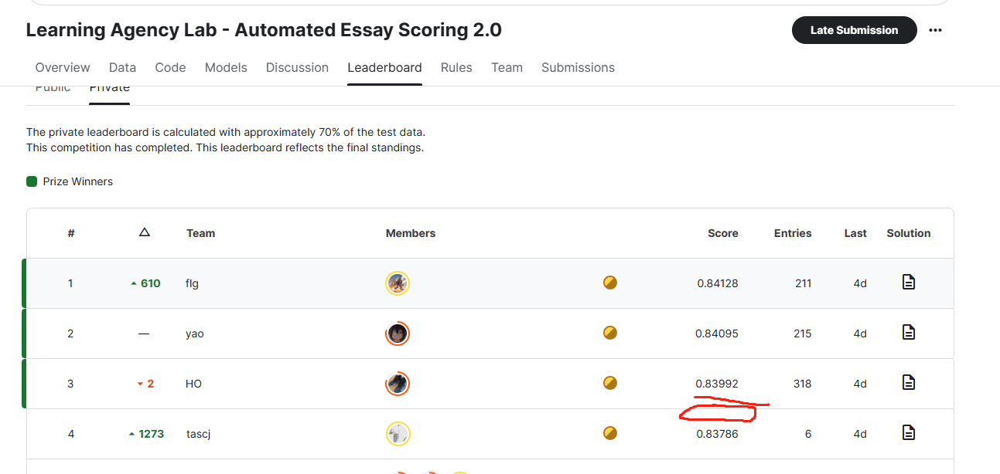
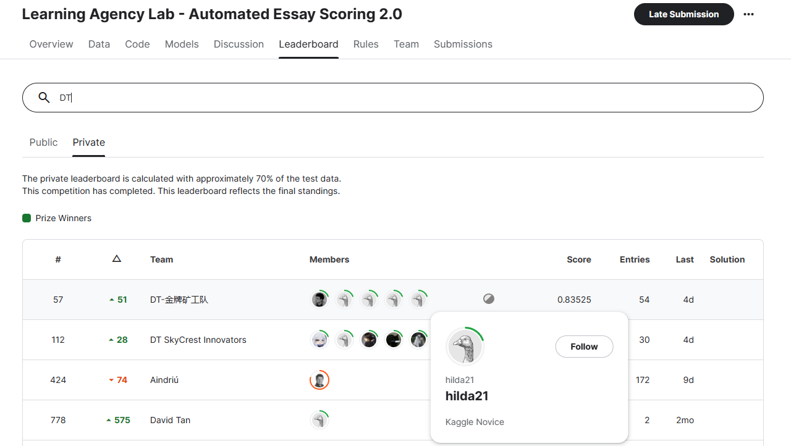
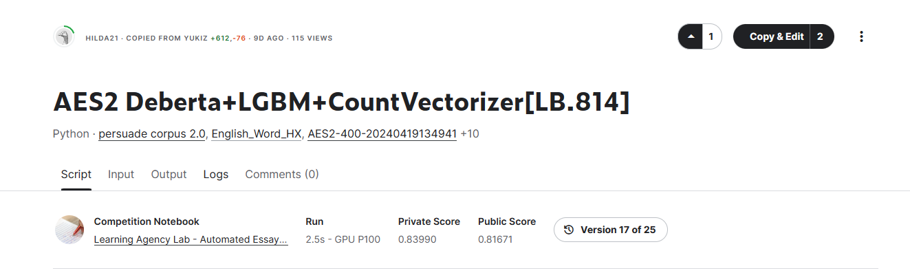
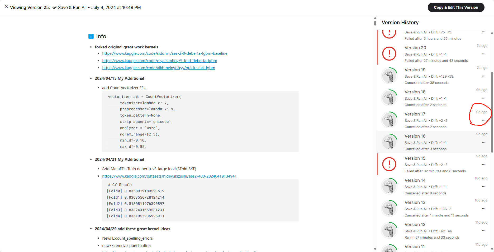

# kaggle竞赛Learning Agency Lab - Automated Essay Scoring 2.0比赛 2队银牌/第4名笔记本

**比赛链接** <https://www.kaggle.com/competitions/learning-agency-lab-automated-essay-scoring-2/overview>

## 一、比赛背景

**比赛目标**

12年前，第一届自动论文评分比赛解决了学生撰写论文的自动评分问题。我们距离最初的比赛还有多远？通过更新的数据集和光年的新想法，我们希望看到我们是否能够获得最新的自动评分，从而为负担过重的教师提供真正的影响，他们在提供及时反馈方面继续面临挑战，尤其是在服务不足的社区。

本次比赛的目标是训练一个模型来为学生论文评分。需要您的努力来减少手工评分这些论文所需的高昂费用和时间。可靠的自动化技术可以允许在测试中引入论文，这是学生学习的一个关键指标，由于评分方面的挑战，目前通常避免使用。 （纯机翻，觉得别扭可以直接看下图）

## 二、评估指标

如上图，提交的内容根据二次加权 kappa 进行评分，该 kappa 衡量两个结果之间的一致性。此指标通常从 0（随机一致性）到 1（完全一致性）不等。如果偶然达成的一致性低于预期，则指标可能会低于 0。

二次加权 kappa 的计算方法如下。首先，构造一个 N x N 直方图矩阵 O，使得 Oi，j 对应于接收到预测值 j 的 s i（实际）的数量。权重的 N 乘 N 矩阵 w 是根据实际值和预测值之间的差值计算的

假设值之间没有相关性，则计算预期结果 E 的 N 乘 N 直方图矩阵。
这被计算为结果的实际直方图向量与预测直方图向量之间的外积，归一化后使得 E 和 O 具有相同的总和。
## 三、数据集

**数据描述**

比赛数据集包括大约 24000 篇学生撰写的议论文。每篇论文的评分范围为 1 到 6（链接到整体评分标准）。您的目标是预测一篇文章从其文本中获得的分数。

文件和字段信息
train.csv - 用作训练数据的论文和分数。

essay_id- 文章的唯一 ID
full_text- 完整的论文回复
score- 论文的整体得分（1-6 分）
test.csv - 用作测试数据的论文。包含与 相同的字段，但排除 。（注意：重新运行测试集大约有 8k 个观测值。train.csvscore

sample_submission.csv - 格式正确的提交文件。

essay_id- 文章的唯一 ID
score- 论文的预测整体分数（1-6 分）

**数据集**

- **文件**

- train.csv - 17307条数据

- test.csv - 用作测试数据的论文。包含与 相同的字段，但排除 。（注意：重新运行测试集大约有 8k 个观测值。train.csvscore

- sample_submission.csv - 正确格式的示例提交文件
- 
 essay_id- 文章的唯一 ID
 score- 论文的预测整体分数（1-6 分）

- **列**

- essay_id- 文章的唯一 ID
- full_text- 完整的论文回复
- score- 论文的整体得分（1-6 分）

## 四、比赛思路与实现

**比赛成绩**
2银

**其中有2个笔记本可达到私有分数榜 第4**

**排行榜：**

**我们最高的笔记本**

**版本17**

**值得一提的是，由于该笔记本的LB较低没有选择到该笔记本提交，比较可惜。**

### **实现思路**

**模型选择**

我们最开始模型是机器学习的LGBM,大模型Deberta-v3-large

**比赛思路**

LGBM 训练/推理代码 [aes2-deberta-lgbm-countvectorizer-lb-814.ipynb](aes2-deberta-lgbm-countvectorizer-lb-814.ipynb)

kaggle 笔记本链接 https://www.kaggle.com/code/hilda21/aes2-deberta-lgbm-countvectorizer-lb-814

首先我们做了以下实验：

通过统计的方式构建： aragraph 特征 ，Sentence 特征 ，Word 特征 ，使用机器学习库实现 Tfidf 特征，CountVector 特征

- Paragraph 特征
- Sentence 特征
- Word 特征
- Tfidf 特征
- CountVector 特征

使用公开笔记本的deberta模型，然后使用公开笔记本的deberta模型的oof文件和训练集做堆叠融合，
作为新的特征给LGBM做分类。

我们发现比赛方的数据 和一个公开数据集Persuade 2.0 Corpus 很相似，链接为  https://www.kaggle.com/datasets/nbroad/persaude-corpus-2
我们发现该数据集有prompt_name字段，我们通过分析发现比赛方的数据属于该公开数据集的7个不同的prompt_name，之后我们构建了7个特征，表示这条数据属于那个分组，字段为。
'prompt_0','prompt_1','prompt_2','prompt_3','prompt_4','prompt_5','prompt_6'，属于该分组，值为1，不属于为0.

我们还使用了 特征重要性选择，使用5折LGBM交叉验证训练数据，获得特征重要性排序，得到前13000的特征，并添加我们的7个新特征，之后使用LGBM 15折交叉验证训练，进行分类。

当然我们还尝试了许多添加特征的实验和训练策略实验，但给我们pass掉了。
1. 添加6个特征 ['cohesion', 'syntax', 'vocabulary', 'phraseology', 'grammar', 'conventions'] cv提升，但LB降低。
2. 添加textstat库的可读性，等等特征 cv提升，lb也提升，到0.818之后，很难提升。
3. 添加自己的deberta oof特征替换公开的oof cv提升（数据泄露），lb降低。
4. 分组7折交叉验证，cv降低，lb降低，但是 cv和lb相关性很高。

**最终我们很可惜的错过了选择该笔记本，选择了0.835的笔记本，不过我们也是拿到了银牌，比赛主要是为了学习。**

